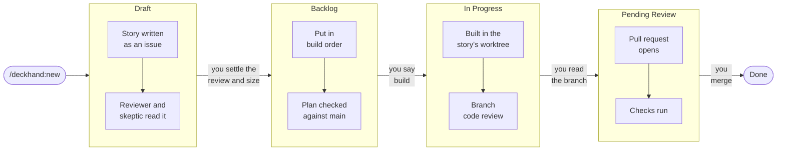

# deckhand

[](https://github.com/JSA-Partners/deckhand/tags)
[](https://github.com/JSA-Partners/deckhand/actions/workflows/ci.yaml)
[](LICENSE)

A story process for Claude Code: from feature request to merged pull request, kept in GitHub issues.

deckhand is a [Claude Code](https://code.claude.com/) plugin that runs on
[superpowers](https://github.com/obra/superpowers). superpowers does the brainstorming, planning,
and implementation. deckhand adds the process around it: one issue per story, a review you settle in
conversation, a board that follows the work, and a pull request that opens only from a commit you
have read.

## Table of Contents

- [Background](#background)
- [Install](#install)
- [Usage](#usage)
- [How it is built](#how-it-is-built)
- [Contributing](#contributing)
- [License](#license)

## Background

A story is one GitHub issue, written by Claude and frozen once the build starts. Its comments are the
log, one entry per decision, so the issue reads top to bottom as what was planned, what was decided,
and why. The story sits on a GitHub Project board from the moment it is written and moves from
Draft to Done as the work does.



The arrows are your decisions. The boxes are what Claude does between them. Several sessions can
work from one clone, each on its own story in its own git worktree, and a worktree goes away when
its story merges.

Nothing about a story is written to the repository, and a branch reaches GitHub only with its pull
request. You never act on GitHub. You open it to read.

## Install

### Dependencies

- [Claude Code](https://code.claude.com/) with [superpowers](https://github.com/obra/superpowers)
- [`gh`](https://cli.github.com/), authenticated with the `project` scope: `gh auth refresh -s project`
- Admin rights on the repository, so setup can make squash the only merge
- Python 3.12 or newer
- [tuicr](https://github.com/agavra/tuicr), for your pass over the branch before the pull request
- A GitHub Project, or setup creates one

deckhand works with GitHub only.

### Plugins

```bash
claude plugin marketplace add obra/superpowers
claude plugin install superpowers@superpowers-dev
claude plugin marketplace add JSA-Partners/deckhand
claude plugin install deckhand@jsapartners
```

### Updating

```bash
claude plugin update deckhand@jsapartners
```

Then restart every running Claude Code session, because a session keeps the version it started
with, and run `/deckhand:setup` again in each repository. Setup fixes what a new release changed on
the board and says setup is complete when nothing did. Stories in flight are safe: their state lives
in their issues.

## Usage

These are slash commands, typed in a Claude Code session in your repository.

```text
/deckhand:setup
/deckhand:new "let people export their data as CSV"
/deckhand:next 42
/deckhand:captain
```

Run setup once per repository. It links the repository to a GitHub Project, does what the GitHub API
allows, and tells you what is left and where to click. Run it again until it says setup is complete.

### Stories

`new` is a conversation sized to the idea: a question or two for a fix, a whole brainstorm for a
feature. A big idea comes out as several stories, split in the order they have to land and blocked on
each other where one needs another first, across repositories when the work spans them.

`next` carries a story from wherever it is to the next decision that is yours, and stops there. Run
it again, in any session, and it picks up where the story is. Work found mid-build can be parked as
a new story in any repository of the project, carrying what the session learned.

### The captain

`captain` is the project manager. It reads the whole project at once, every story and its column,
every Claude Code session and what it is working on, and opens with what to run next and where.
After that, ask it anything: what is blocked, what a session is up to, what to pick up. It writes
to the board only, to put the backlog in build order, add a blocker a story gained late, or move a
story back to the column its log says it belongs in.

Ask it for a forecast and it gives a stakeholder two numbers for everything left on the board: a
floor, from the critical path through the blockers and the sessions you run, and a commitment that
is deliberately pessimistic. Both are measured rather than estimated, from how long finished stories
actually took, so the numbers get better as the board fills and the forecast says how thin its
history still is.

| Command | What it does |
| --- | --- |
| `/deckhand:setup` | Links the repository to a GitHub Project and fixes the board's fields |
| `/deckhand:new "<idea>"` | Turns an idea into a story, or a big idea into several |
| `/deckhand:next N` | Carries story N on to your next decision |
| `/deckhand:captain` | Answers for the whole project and says what to run next |
| `/deckhand:commit` | Writes a conventional commit for the staged changes |
| `/deckhand:document` | Records what a branch taught in `docs/claude/` |

## How it is built

deckhand is largely written by Claude Code. Every design is worked out with a human in a brainstorm
and a plan, and every change is read by hand before it is committed. It runs daily on real product
work, and what trips it up there becomes the next release.

## Contributing

Questions and bug reports go in [issues](https://github.com/JSA-Partners/deckhand/issues), and pull
requests are welcome. See [CONTRIBUTING.md](CONTRIBUTING.md) for the development setup and the
commit rules.

## License

[MIT](LICENSE). Built by [JSA+Partners](https://jsapartners.co).
