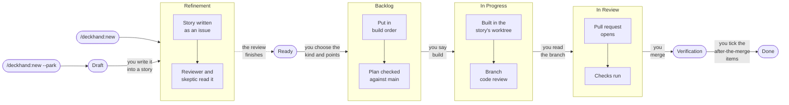

# deckhand

[](https://github.com/JSA-Partners/deckhand/releases)
[](https://github.com/JSA-Partners/deckhand/actions/workflows/ci.yaml)
[](LICENSE)

A story process for Claude Code: from feature request to merged pull request, kept in GitHub issues.

deckhand is a [Claude Code](https://code.claude.com/) plugin that runs on
[superpowers](https://github.com/obra/superpowers). superpowers does the brainstorming, planning,
and implementation. deckhand adds the process around it: one issue per story, a review you settle in
conversation, a board that follows the work, and a pull request that opens only from a commit you
have read.

## Table of Contents

- [Background](#background)
- [Install](#install)
- [Usage](#usage)
- [How it is built](#how-it-is-built)
- [Contributing](#contributing)
- [License](#license)

## Background

A story is one GitHub issue, written by Claude and frozen once the build starts. Its comments are the
log, one entry per decision, so the issue reads top to bottom as what was planned, what was decided,
and why. The story sits on a GitHub Project board from the moment it is written and moves from
Refinement to Done as the work does. A feature nobody has settled yet waits in Draft until it is
written into one.


```mermaid
flowchart LR
    idea(["/deckhand:new"]) --> Refinement
    parked(["/deckhand:new --park"]) --> Draft([Draft])

    subgraph Refinement
        direction TB
        r1[Story written<br/>as an issue] --> r2[Reviewer and<br/>skeptic read it]
    end

    subgraph Backlog
        direction TB
        b1[Put in<br/>build order] --> b2[Plan checked<br/>against main]
    end

    subgraph InProgress [In Progress]
        direction TB
        i1[Built in the<br/>story's worktree] --> i2[Branch<br/>code review]
    end

    subgraph InReview [In Review]
        direction TB
        p1[Pull request<br/>opens] --> p2[Checks run]
    end

    Draft -->|you write it<br/>into a story| Refinement
    Refinement -.->|the review<br/>finishes| Ready([Ready])
    Ready -->|you choose the<br/>kind and points| Backlog
    Backlog -->|you say<br/>build| InProgress
    InProgress -->|you read<br/>the branch| InReview
    InReview -->|you<br/>merge| Verification([Verification])
    Verification -->|you tick the<br/>after-the-merge<br/>items| Done([Done])
```

The solid arrows are your decisions. The dashed one happens on its own. The boxes are what Claude
does between them. Several sessions can work from one clone, each on its own story in its own git
worktree, and a worktree goes away when its story merges.

Nothing about a story is written to the repository, and a branch reaches GitHub only with its pull
request. You never act on GitHub. You open it to read.

## Install

### Dependencies

- [Claude Code](https://code.claude.com/) with [superpowers](https://github.com/obra/superpowers)
- [`gh`](https://cli.github.com/), authenticated with the `project` scope: `gh auth refresh -s project`
- Admin rights on the repository, so setup can make squash the only merge
- Python 3.12 or newer
- [tuicr](https://github.com/agavra/tuicr), for your pass over the branch before the pull request
- A GitHub Project, or setup creates one

deckhand works with GitHub only.

### Plugins

```bash
claude plugin marketplace add obra/superpowers
claude plugin install superpowers@superpowers-dev
claude plugin marketplace add JSA-Partners/deckhand
claude plugin install deckhand@jsapartners
```

### Updating

```bash
claude plugin update deckhand@jsapartners
```

Then restart every running Claude Code session, because a session keeps the version it started
with. It tells you when it is behind. Nothing else is owed by default: `/deckhand:captain` says if
the board needs setup run again or a story sits in the wrong column. Stories in flight are safe:
their state lives in their issues.

## Usage

These are slash commands, typed in a Claude Code session in your repository.

```text
/deckhand:setup
/deckhand:new "let people export their data as CSV"
/deckhand:next 42
/deckhand:captain
```

Run setup once per repository. It links the repository to a GitHub Project, does what the GitHub API
allows, and tells you what is left and where to click. Run it again until it says setup is complete.

### Stories

`new` is a conversation sized to the idea: a question or two for a fix, a whole brainstorm for a
feature. A big idea comes out as several stories, split in the order they have to land and blocked on
each other where one needs another first, across repositories when the work spans them.

`next` carries a story from wherever it is to the next decision that is yours, and stops there. Run
it again, in any session, and it picks up where the story is. Work found mid-build can be parked as
a new story in any repository of the project, carrying what the session learned.

### The captain

`captain` is the project manager. It reads the whole project at once, every story, its column and
who holds it, every open Claude Code session on this machine and what it is working on. It opens
with the sessions waiting on you and what each one asks, then what moved since you last looked,
then what to run next and where, and which open pull request to merge first.
After that, ask it anything: what is blocked, what a session is up to, what to pick up. Give it a
priority and it plans lanes, one session each, keeping stories whose plans touch the same files
apart. It writes
to the board only, to put the backlog in build order, add a blocker a story gained late, or board a
story it owns that never reached the board.

Ask it for a forecast and it says in weeks when everything left on the board is likely done, drawn
from how many stories the board finished each week, the way a feature is forecast below. The method
was chosen on a short history, so it is worth checking again as the history grows.

### Features

A feature is an option of the project's single-select Feature field, never an issue, so the board
holds only units of work and a feature spans every repository of the project. The option's name is
the feature's name, its description says what it delivers, and the order of the options is the
order the features are built in. A story belongs to a feature by its Feature value.

```text
deckhand epic open "Let guests into a collection" --about "A client sees their own collection and nothing else."
deckhand epic add "Let guests" 261 259 owner/front-end#133
deckhand epic list
deckhand epic forecast "Let guests into a collection"
```

`epic open` creates the Feature field the first time and adds each later feature at the end. A
feature is named by its option id, by its name in any case and spacing, or by the start of one name
alone. A name that matches two features refuses and lists each with its option id.

To reorder the features, drag the options in the project's settings for the Feature field. Deleting
an option clears that feature from every story that held it.

`new` offers the features when it boards a story. A story split from a feature's story does not join
the feature by itself, so the captain lists it under Anomalies with the command that adds it.

`epic add` refuses a story that is off the board, not a deckhand story, or closed as not planned or
as a duplicate, and writes nothing until every one passes. A story already in another feature moves.

`epic forecast` says how many weeks the feature's open stories will take, and with `--json` gives
dates and the day the feature's work began. It counts how many of the feature's own stories finished
each week and draws whole weeks from those counts, the method of Daniel Vacanti's "When Will It Be
Done?". A week with nothing finished counts as zero, so client work, weekends and stalls are
already in the numbers.

Each simulated run first resamples the measured weeks, so a short history gives a wider range, and
a resample with no finished week is drawn again. The weeks start when the first of the feature's
stories started, a first week that began partway through is left out, and the forecast draws from
the last twelve full weeks.

A draft with no stories listed yet counts as the average a finished parked feature became once five
have finished, as the largest seen before that, and as one story before any has. A piece is one
issue, so a draft not yet split is one piece even though the forecast counts it as several. A story
closed as not planned or as a duplicate is not a piece.

The floor is the 50th percentile, the commitment the 90th and the worst case the 99th. On a real
board's history the commitment was met 86 percent of the time. In simulated steady work, the first
forecast a feature gets met its commitment 89 percent of the time, and 87 percent in the worst case.

There is no date range until four weeks have passed since the feature's work began and five of its
stories have finished in the weeks measured, nor when every week measured finished the same number,
nor when the commitment would be over two years out, and the forecast says which. A worst case
past two years reads as beyond two years.

| Command | What it does |
| --- | --- |
| `/deckhand:setup` | Links the repository to a GitHub Project and fixes the board's fields |
| `/deckhand:new "<idea>"` | Turns an idea into a story, or a big idea into several |
| `/deckhand:next N` | Carries story N on to your next decision |
| `/deckhand:captain` | Answers for the whole project and says what to run next |
| `/deckhand:commit` | Writes a conventional commit for the staged changes |
| `/deckhand:document` | Records what a branch taught in `docs/claude/` |

## How it is built

deckhand is largely written by Claude Code. Every design is worked out with a human in a brainstorm
and a plan, and every change is read by hand before it is committed. It runs daily on real product
work, and what trips it up there becomes the next release.

## Contributing

Questions and bug reports go in [issues](https://github.com/JSA-Partners/deckhand/issues), and pull
requests are welcome. See [CONTRIBUTING.md](CONTRIBUTING.md) for the development setup and the
commit rules.

## License

[MIT](LICENSE). Built by [JSA+Partners](https://jsapartners.co).
